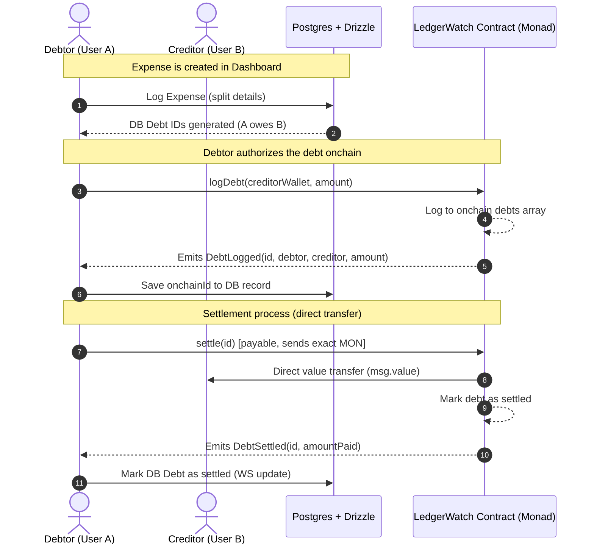

# FINALITY

```text
  ___ ___ _  _   _   _    ___ _____   __
 | __|_ _| \| | /_\ | |  |_ _|_   _\ \ / /
 | _| | || .` |/ _ \| |__ | |  | |  \ V / 
 |_| |___|_|\_/_/ \_\____|___| |_|   |_|  
=============================================================
  >> ONCHAIN DEBT SURVEILLANCE & SETTLEMENT CONTROL ROOM <<
```

[](https://monad.xyz)
[](#)
[](LICENSE)

**[Open Control Room Dashboard &rarr;](/dashboard)** &middot; **[Inspect LedgerWatch.sol Contract](contracts/src/LedgerWatch.sol)** &middot; **[Configure Settings](/settings)**

---

## 📡 Live Feed Operations

Group expenses don't just get tracked here. They get monitored. Finality turns the passive, forgotten "I'll pay you back" into a live operational control room feed: every debt logged, every wallet balance graphed, and every settlement finalized onchain the moment it happens.

- **Zero Escrow, Zero Pool**: Funds never sit in a smart contract. Settlement is an immediate, direct wallet-to-wallet transfer.
- **Exact-Amount Enforcement**: The contract rejects any transaction that doesn't match the debt balance exactly. No fractional slippage, no rounding games.
- **Force-Directed Debt Graph**: A real-time spatial graph mapping wallet addresses as nodes and debt relations as edges. Watch settlement pulses travel across the network.

---

## 🛠️ System Architecture

Finality uses a hybrid synchronization model. Debts are created inside group consoles, mirrored in a PostgreSQL database (via Drizzle ORM) for lighting-fast UI rendering, logged to the Monad Testnet blockchain by the debtor, and settled with native currency (`MON`) transfers.



---

## 📦 Smart Contract Interface

The core logic is deployed in `LedgerWatch.sol` and operates without owner keys or upgrade proxies. It is deterministic, immutable ledger surveillance.

```solidity
struct Debt {
    address debtor;
    address creditor;
    uint256 amount;   // in wei (MON)
    bool settled;
}

// Write: Registers a new debt where msg.sender is the debtor
function logDebt(address creditor, uint256 amount) external returns (uint256 id);

// Write: Settles a debt by transmitting msg.value directly to the creditor
function settle(uint256 id) external payable;

// Read: Returns detailed debt metadata
function getDebt(uint256 id) external view returns (Debt memory);
```

### Deployed Contract Details
* **Contract Address**: [`0x80297E799b71D0913Ce74C7dBb1CB9640e039e92`](https://testnet.monadexplorer.com/address/0x80297E799b71D0913Ce74C7dBb1CB9640e039e92)
* **Network**: Monad Testnet (Chain ID: `10143`)
* **Verification Status**: Verified Source on Monad Explorer

---

## ⚡ Tech Stack

| Component | Technology | Description |
|---|---|---|
| **Frontend UI** | [Next.js](https://nextjs.org) (v16) &amp; TypeScript | High-performance React framework |
| **Styling** | [Tailwind CSS](https://tailwindcss.com) (v4) | Instrument-panel design token system |
| **Web3 Engine** | [wagmi](https://wagmi.sh) &amp; [viem](https://viem.sh) | Web3 React hooks &amp; utilities |
| **Wallet Connector** | [RainbowKit](https://www.rainbowkit.com) | Premium multi-wallet connection |
| **Local Sandbox** | [Foundry](https://book.getfoundry.sh) | Smart contract testing and local scripting |
| **Off-chain Cache** | [Drizzle ORM](https://orm.drizzle.team) &amp; Neon Postgres | Fast data caching and metadata tracking |
| **Graph Visualization**| D3 Force Simulation | Force-directed nodes and settlement pulses |

---

## 🖥️ Local Installation &amp; Execution

### 1. Contract Environment Setup
Navigate to the contracts suite, install dependencies, and run test assertions:
```bash
cd contracts

# Install foundry dependencies
forge install

# Run contract tests
forge test -vv
```

To run a testnet deployment simulation using the deployment script:
```bash
forge script script/Deploy.s.sol:Deploy --rpc-url https://testnet-rpc.monad.xyz --broadcast
```

### 2. Web Console Setup
Create a `.env` file in the project root matching `.env.example`:
```env
DATABASE_URL=postgresql://<user>:<password>@<host>/<database>?sslmode=require
```

Install frontend packages and launch the local monitoring server:
```bash
# Return to root directory
cd ..

# Install frontend dependencies
npm install

# Run migrations (if schemas updated)
npx drizzle-kit push

# Spin up development client
npm run dev
```
Open **[http://localhost:3000](http://localhost:3000)** in your browser to inspect the application.

---

## 🦊 Wallet Integration Configuration

To connect your wallet to the Monad Testnet network, add the following RPC parameters:

```text
Network Name:      Monad Testnet
New RPC URL:       https://testnet-rpc.monad.xyz
Chain ID:          10143
Currency Symbol:   MON
Block Explorer:    https://testnet.monadexplorer.com
```

---

## ⚖️ Finality Comparison Matrix

| Feature | Finality | Traditional Apps (Splitwise, etc.) | Custodial Pools |
|---|---|---|---|
| **Settlement Speed** | Instantaneous (Monad block time) | Delayed (Days via Bank / Manual log) | Slow (Escrow unlocking steps) |
| **Funds Custody** | **None** (Direct wallet-to-wallet transfer) | None (IOU tracking only, no payment) | Escrowed (High risk of pool hacks) |
| **Record Verifiability** | Cryptographically signed, onchain | Self-reported database entries | Locked in proprietary system |
| **Settlement Enforcement** | Contract-level exact amount matching | No check (manually written amounts) | Subject to exit/withdrawal fees |

---

*Finality. Built for tonight's dinner bill, verified onchain forever.*
