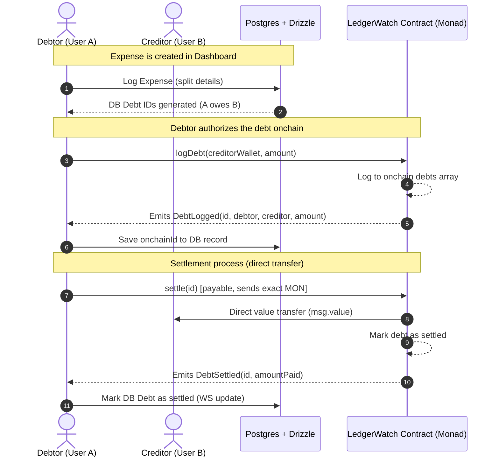

# TALLY

```text
  ___ ___ _  _   _   _    ___ _____   __
 | __|_ _| \| | /_\ | |  |_ _|_   _\ \ / /
 | _| | || .` |/ _ \| |__ | |  | |  \ V / 
 |_| |___|_|\_/_/ \_\____|___| |_|   |_|  
=============================================================
  >> ONCHAIN DEBT SURVEILLANCE & SETTLEMENT CONTROL ROOM <<
```

[](https://monad.xyz)
[](#)
[](LICENSE)

**[Open Control Room Dashboard &rarr;](/dashboard)** &middot; **[Inspect LedgerWatch.sol Contract](contracts/src/LedgerWatch.sol)** &middot; **[Configure Settings](/settings)**

---

## 📡 Live Feed Operations

Group expenses don't just get tracked here. They get monitored. **Tally** turns the passive, forgotten "I'll pay you back" into a live operational control room feed: every debt logged, every wallet balance graphed, and every settlement finalized onchain the moment it happens.

No spreadsheets. No pooled escrow. No trust required—the contract enforces the exact amount, and money moves directly between the two wallets involved.

---

## 🖥️ Surveillance Console

Below is the live operational feed and force-directed debt network tracking credit vectors:


*Figure 1.0: Real-time surveillance grid mapping wallet nodes (participants) and active debt relationships (edges).*

> [!TIP]
> **Please save your dashboard screenshot as `public/dashboard.png`** to render it directly inside this console view!

---

## ⚡ Key Surveillance Vectors

* **Spatial Debt Graph**: Nodes represent participants. Directed edges map debt vectors. The thickness corresponds to the amount owed, and the edge colors represent warning levels:
  * <span style="color: #3b6fd6">■</span> **Blue**: Pending/Active debt.
  * <span style="color: #1f9e5c">■</span> **Green**: Settled and confirmed onchain.
  * <span style="color: #d98a1f">■</span> **Orange**: Warning status (overdue debt).
  * <span style="color: #d6394a">■</span> **Red**: Critical warning status (long-overdue debt).
* **Zero Custody**: Funds never touch a pooled contract balance—settlement is a direct `MON` transfer between wallets, enforced cryptographically by the contract.
* **Exact-Amount Matching**: The contract rejects any transaction that does not match the debt balance to the wei. No slippage, no rounding games.
* **Asynchronous Speed**: Powered by Monad's high-throughput execution, transactions confirm instantly, triggering immediate settlement pulses along the graph.

---

## 🛠️ System Architecture

Tally utilizes a hybrid synchronization model:
1. **Off-chain Cache**: A local Postgres instance synchronized via Drizzle ORM indexes metadata, groups, and membership.
2. **Onchain Settlement**: The `LedgerWatch` smart contract acts as the source of truth for debt status and wallet-to-wallet transfers.



---

## 📦 Smart Contract Specs

The contract operates without an owner admin key or upgrade proxy. What is deployed is what runs.

```solidity
struct Debt {
    address debtor;
    address creditor;
    uint256 amount;   // in wei (MON)
    bool settled;
}

// Write: Registers a new debt where msg.sender is the debtor
function logDebt(address creditor, uint256 amount) external returns (uint256 id);

// Write: Settles a debt by transmitting msg.value directly to the creditor
function settle(uint256 id) external payable;

// Read: Returns detailed debt metadata
function getDebt(uint256 id) external view returns (Debt memory);
```

### Deployed Contract Details
* **Contract Address**: [`0x80297E799b71D0913Ce74C7dBb1CB9640e039e92`](https://testnet.monadexplorer.com/address/0x80297E799b71D0913Ce74C7dBb1CB9640e039e92)
* **Network**: Monad Testnet (Chain ID: `10143`)
* **Verification Status**: Verified Source on Monad Explorer

---

## 💻 Tech Stack Configuration

| Layer | Component | Implementation |
|---|---|---|
| **Core** | Frontend | Next.js (v16), React (v19) |
| **Logic** | Language | TypeScript &amp; Solidity ^0.8.27 |
| **Styling** | UI System | Tailwind CSS (v4) |
| **EVM Interface** | Web3 SDK | wagmi &amp; viem &amp; RainbowKit |
| **Foundry Tooling** | Smart Contracts | Forge test suite &amp; Deploy script |
| **Database** | Metadata Cache | Drizzle ORM + PostgreSQL |

---

## 🖥️ Local Installation &amp; Execution

### 1. Contract Environment Setup
Navigate to the contracts suite, install dependencies, and run test assertions:
```bash
cd contracts

# Install foundry dependencies
forge install

# Run contract tests
forge test -vv
```

To run a testnet deployment simulation using the deployment script:
```bash
forge script script/Deploy.s.sol:Deploy --rpc-url https://testnet-rpc.monad.xyz --broadcast
```

### 2. Web Console Setup
Create a `.env` file in the project root matching `.env.example`:
```env
DATABASE_URL=postgresql://<user>:<password>@<host>/<database>?sslmode=require
```

Install frontend packages and launch the local monitoring server:
```bash
# Return to root directory
cd ..

# Install frontend dependencies
npm install

# Run migrations (if schemas updated)
npx drizzle-kit push

# Spin up development client
npm run dev
```
Open **[http://localhost:3000](http://localhost:3000)** in your browser to inspect the application.

---

## 🦊 Wallet Integration Configuration

To connect your wallet to the Monad Testnet network, add the following RPC parameters:

```text
Network Name:      Monad Testnet
New RPC URL:       https://testnet-rpc.monad.xyz
Chain ID:          10143
Currency Symbol:   MON
Block Explorer:    https://testnet.monadexplorer.com
```

---

## ⚖️ Tally Comparison Matrix

| Feature | Tally | Traditional Apps (Splitwise, etc.) | Custodial Pools |
|---|---|---|---|
| **Settlement Speed** | Instantaneous (Monad block time) | Delayed (Days via Bank / Manual log) | Slow (Escrow unlocking steps) |
| **Funds Custody** | **None** (Direct wallet-to-wallet transfer) | None (IOU tracking only, no payment) | Escrowed (High risk of pool hacks) |
| **Record Verifiability** | Cryptographically signed, onchain | Self-reported database entries | Locked in proprietary system |
| **Settlement Enforcement** | Contract-level exact amount matching | No check (manually written amounts) | Subject to exit/withdrawal fees |

---

*Tally. Built for tonight's dinner bill, verified onchain forever.*
